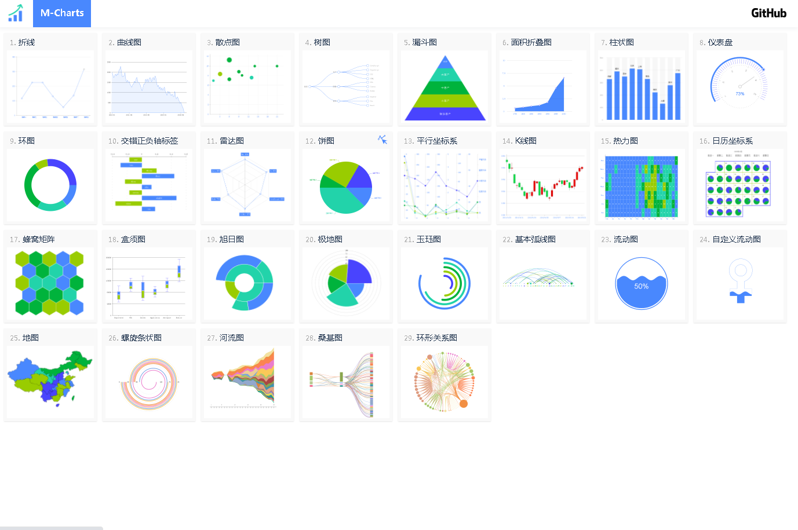

# M-Charts
基于Canvas的Charts实现的技术预研

## DEMO
[在线预览](https://bojue.github.io/M-Charts)



## 下载

```
git clone https://github.com/bojue/M-Charts.git

cd M-Charts

npm i
```

## 运行

```
npm run dev

```

## 已经实现Chart类型

[组件code](https://github.com/bojue/M-Charts/tree/main/src/charts/shape)


## TODO List 

- 实现基础Chart Demo展示(Doing) 
- 事件交互
- 完善chart
- 动画
- 变量封装
- 框架封装

## chart效果

https://www.zingchart.com/gallery/radar-chart-heatmap