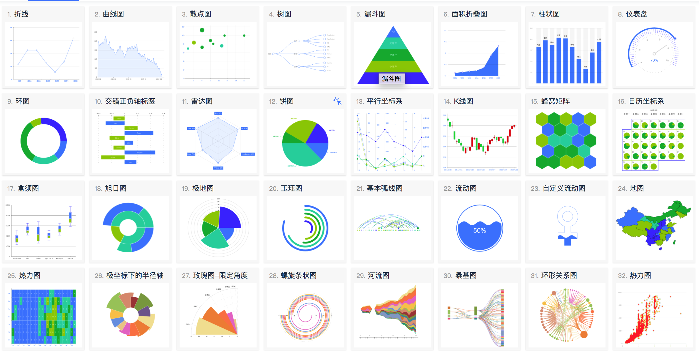

# M-Charts
基于Canvas的Charts实现的技术预研

## DEMO
[在线预览](https://bojue.github.io/M-Charts)



## 下载

```
git clone https://github.com/bojue/M-Charts.git

cd M-Charts

npm i
```

## 运行

```
npm run dev

```

## 已经实现Chart类型

1. 饼图图
2. 折线图
3. 散点图
4. 仪表盘
5. 漏斗图
6. 柱状图
7. 雷达图
8. 树图
9. 面积折叠图
10. 平行坐标系
11. K线图
12. 热力图

## TODO List 

- 实现基础Chart Demo展示(Doing) 
- 交互
- 完善chart
- 动画
- 变量封装
- 框架封装